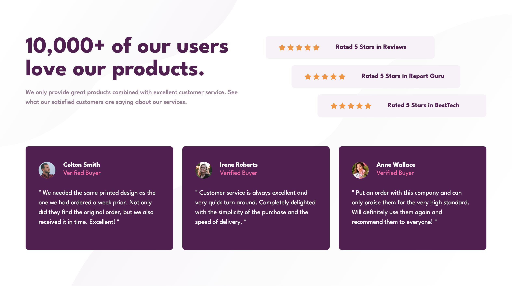
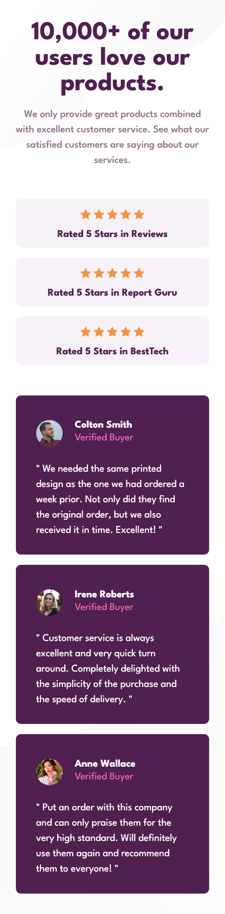

# Frontend Mentor - Social proof section solution

This is a solution to the [Social proof section challenge on Frontend Mentor](https://www.frontendmentor.io/challenges/social-proof-section-6e0qTv_bA). Frontend Mentor challenges help you improve your coding skills by building realistic projects.

## Table of contents

- [Overview](#overview)
  - [The challenge](#the-challenge)
  - [Screenshot](#screenshot)
  - [Links](#links)
- [My process](#my-process)
  - [Built with](#built-with)
  - [What I learned](#what-i-learned)
  - [Continued development](#continued-development)
  - [Useful resources](#useful-resources)
- [Author](#author)
- [Acknowledgments](#acknowledgments)

## Overview

### The challenge

Users should be able to:

- View the optimal layout for the section depending on their device's screen size

### Screenshot




### Links

- Solution URL: [on Frontend Mentor](https://www.frontendmentor.io/solutions/social-proof-section-UUKQlLFUT4)
- Live Site URL: [on Github](https://pykm.github.io/social-proof-section/)

## My process

### Built with

- Semantic HTML5 markup
- CSS custom properties
- Flexbox
- Mobile-first workflow

### What I learned

Use `blockquote` element along with `figure` and `figcaption` elements to semantically represent a block of quote, in this case, the comment.

Please see my implementation as below:

```html
<figure class="comment">
  <figcaption class="colton">
    <div class="commentator-info">
      <h2>Colton Smith</h2>
      <p>Verified Buyer</p>
    </div>
  </figcaption>
  <blockquote>
    <p>We needed the same printed design as the one we had ordered a week prior.
  Not only did they find the original order, but we also received it in time.
  Excellent!</p>
  </blockquote>
</figure>
```

Use `:nth-child` pseudo class to select sibling elements. A code example as below:
```css
.rating:nth-child(1) {
  align-self: flex-start;
}

.rating:nth-child(2) {
  align-self: center;
}

.rating:nth-child(3) {
  align-self: flex-end;
}
```

### Continued development

Technique that I'm not completely comfortable with, can be found in this challenge:
- Use `figure`, `figcaption` and `blockquote` elements.

Technique that I found useful, although not using in this challenge:
- SASS

### Useful resources

- [The Block Quotation element on MDN](https://developer.mozilla.org/en-US/docs/Web/HTML/Element/blockquote) - This helped me to add semantic element for all the comments.
- [vcarames' solution on Github](https://vcarames.github.io/Social-Proof-Section/) - This is an amazing solution, which helped me to determine what semantic tags should be used.

## Author

- Website - [PYkm](https://pykm.github.io/)
- Frontend Mentor - [@PYkm](https://www.frontendmentor.io/profile/PYkm)

## Acknowledgments

- **vcarames**. Your solution on this challenge is helpful to me when I can't figure out what tags to use. Thank you for the inspiration.
